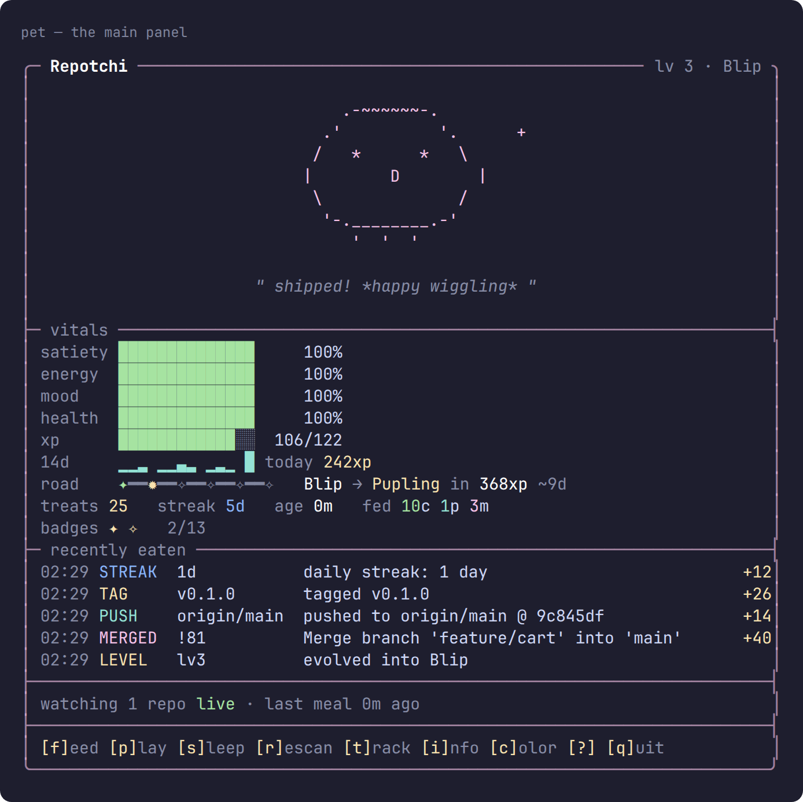
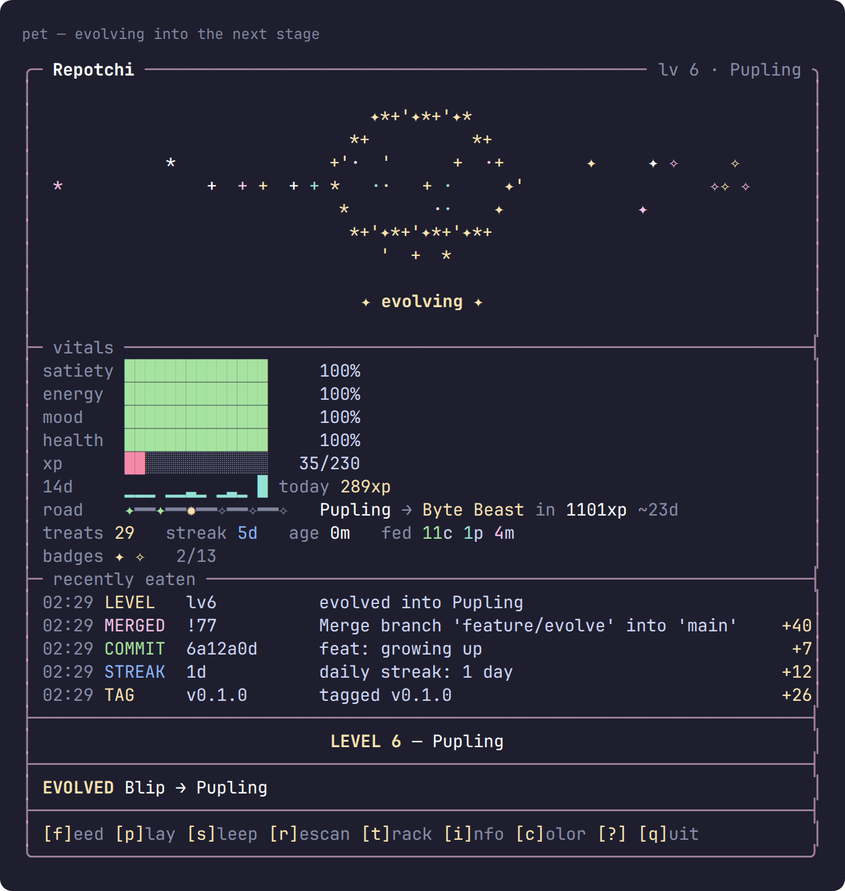
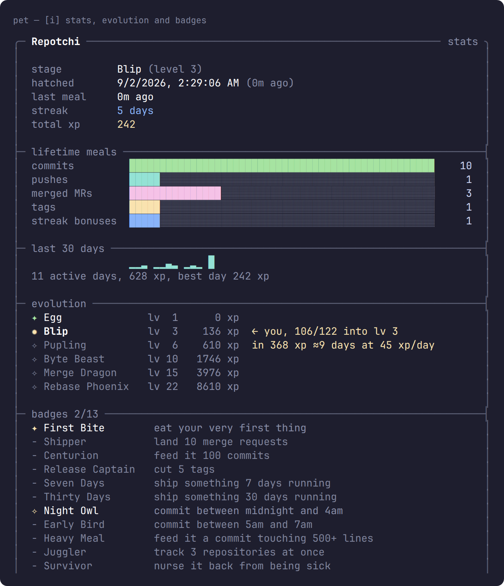
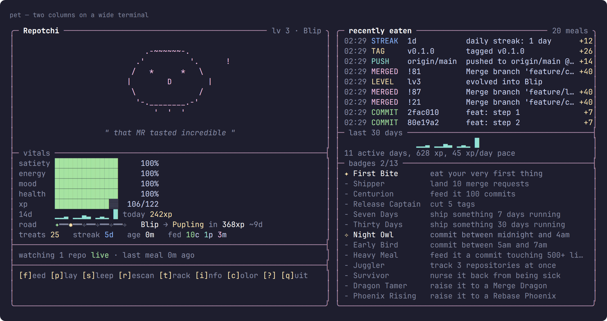

# repotchi

A terminal pet that lives on your git activity. It eats commits, pushes, merged
merge requests and tags. Ignore your repo and it gets hungry, miserable, then
sick. Ship something and it evolves.

Everything happens in the terminal. No network, no service, no API tokens — it
reads your local git history and nothing else.



It watches `.git` directly, so a commit is eaten about half a second after you
make it. Feed it and its mouth opens; play and it grins; leave it and it yawns,
glances around, and eventually gets hungry. When it changes stage the old form
dissolves and the new one is revealed:



The **road** row shows where it is, what it becomes next, and how far away that
is at your recent pace. Press `i` for the full timeline with every threshold:



On a wide terminal it spreads into two columns:



Every image above is a capture of the running program (`npm run screenshots`).

## Install

Node 18 or newer and `git`. No npm dependencies, so nothing to install.

```bash
npx git+https://gitlab.example.com/you/repotchi.git      # no install
npm i -g repotchi                                        # or globally
```

Or take the single file, which needs only Node:

```bash
curl -o ~/.local/bin/pet https://gitlab.example.com/you/repotchi/-/raw/main/dist/pet
chmod +x ~/.local/bin/pet
```

If you symlink `bin/pet` yourself, use an **absolute** path. A relative symlink
target resolves against the link's own directory, not yours, and quietly
produces a dead link that reports only `command not found`.

## Start

```bash
cd ~/code/your-project
pet track                # watch this repo
pet hook install         # feed it automatically on every commit
pet                      # open the live view
```

Running `pet` with nothing tracked shows a guide instead of an inert egg, so
you can also just run `pet` and follow it.

**If anything looks wrong, run `pet doctor`.** It checks Node, git, your state
file, your terminal and every tracked repo, and explains what to do about
whatever it finds.

## Commands

| Command | What it does |
| --- | --- |
| `pet` | the live, animated TUI |
| `pet doctor` | check the setup and explain anything wrong |
| `pet config [key] [value]` | show or change settings, e.g. `pet config frame blue` |
| `pet render` | print one frame and exit |
| `pet scan` | look for new git activity and feed the pet |
| `pet status` | one line, for a shell prompt or status bar |
| `pet track [path]` | watch a repo (defaults to the current directory) |
| `pet untrack [path]` | stop watching a repo |
| `pet repos` | list watched repos |
| `pet feed` | spend a treat |
| `pet demo [--all]` | preview every evolution stage and mood |
| `pet hook install\|uninstall` | git hooks that feed the pet on commit |
| `pet reset --yes` | start over from an egg |

Flags: `--ascii` / `--unicode` (auto-detected), `--color` / `--no-color`,
`--frame COLOUR`, `--width N`, `--interval N`, `--quiet`.

## Keys

| Key | Action |
| --- | --- |
| `f` | feed a stored treat |
| `p` | play — mood up, energy down |
| `s` | toggle sleep — energy recovers, hunger slows |
| `r` | rescan now |
| `t` | track the repo in the current directory |
| `n` | rename the pet |
| `i` | stats, badges and evolution |
| `c` | cycle the frame colour (saved) |
| `l` | cycle the log size |
| `?` | help |
| `q` | quit (state is saved) |

## What counts as food

| Event | Nutrition | How it is detected |
| --- | --- | --- |
| commit | small meal, scaled by diff size | `git log` filtered to your `user.email` |
| push | solid meal | remote-tracking ref moved **and** its reflog says `update by push` |
| merged MR | the feast | merge commits, plus any commit whose **full message** matches `See merge request` / `Merge pull request`, which catches GitLab squash merges |
| tag | release-sized snack | new entries under `refs/tags` |
| daily streak | bonus | first activity of each calendar day |

Three things worth knowing:

**Fetching is not pushing.** Remote-tracking refs move for both. Repotchi reads
the ref's own reflog to tell them apart, so pulling a teammate's work does not
feed your pet.

**Adopting a repo does not eat its history.** The first scan records a baseline
only. A ten-year-old repo will not instantly max out your pet.

**Nothing server-side counts.** Opening a merge request, editing its
description, comments and approvals never touch your local git. A merged MR
feeds the pet once you `git fetch` or `git pull` the merge commit.

Every event is recorded by a stable id, so nothing is eaten twice however often
you scan.

## When it never eats

Almost always the same cause: the commits arriving were authored by an address
other than your local `git config user.email`, so they are filtered out. This is
common when your GitLab account email differs from your git config, because
GitLab writes the account address onto squash-merge commits.

```bash
pet doctor
```

It prints your configured address next to the authors it actually sees, and
tells you when nothing in a repo will ever feed the pet.

## Neglect

Vitals decay in real time whether or not the TUI is open:

- satiety falls about 4.5 points per hour
- energy falls about 2 points per hour, and recovers while sleeping
- mood drifts toward a baseline that sinks as hunger rises
- at zero satiety, health drops and the pet gets sick

A sick pet recovers as soon as you feed it. It cannot die — the worst case is a
very sad `x x` face until you commit again.

## Evolution and badges

| Stage | Level | Total xp | Roughly |
| --- | --- | --- | --- |
| Egg | 1 | 0 | new — cracks appear as it nears hatching |
| Blip | 3 | 136 | ~4 merged MRs |
| Pupling | 6 | 610 | ~16 merged MRs |
| Byte Beast | 10 | 1746 | ~44 merged MRs |
| Merge Dragon | 15 | 3976 | ~100 merged MRs |
| Rebase Phoenix | 22 | 8610 | ~216 merged MRs |

Each level costs 36xp more than the last. The `road` row on the main panel
always shows the next stage and the xp to reach it, with a day estimate based on
your last two weeks; the stats screen (`i`) shows the whole timeline. There are
thirteen badges for shipping, streaks, diff size, odd working hours and
evolution milestones.

## Terminals

Unicode is auto-detected from your locale and platform; Windows consoles and
non-UTF-8 terminals get the ASCII layout automatically. Force it either way with
`--ascii` or `--unicode`.

The layout adapts: 108 columns or more gets two columns, under 46 gets a compact
view, and short terminals shed log rows and then padding so the key hints stay
visible down to 24 rows.

## Settings

The frame follows the pet's mood by default — green when happy, pink at a feast,
red when sick — rendered dim so it stays behind the creature. If your terminal
palette makes that too loud, or you just want it to match your theme, pin it:

```bash
pet config                 # list settings, current values and options
pet config frame blue      # saved; used every time
pet config frame mood      # back to following the mood
pet --frame red            # this run only, without changing the saved choice
```

Ten colours: `red green yellow blue magenta cyan white gray pink sky`, plus
`mood`. Inside the TUI, `c` cycles through them and saves as it goes.

## In your prompt

The full TUI is fun, but the useful daily surface is one line:

```bash
pet status
# (^w^) Repotchi lv15 sat71% mood82% streak12d
```

Drop that in a tmux status bar or shell prompt and the pet becomes ambient.

## State

One JSON file at `$XDG_STATE_HOME/repotchi/state.json`, usually
`~/.local/state/repotchi/state.json`. Override with `REPOTCHI_HOME`:

```bash
REPOTCHI_HOME=/tmp/mypet pet render
```

Writes are atomic, a corrupt file is quarantined rather than fatal, and every
write reloads first so git hooks and other shells cannot be reverted. The state
is per-user: a pet fed as root is a different pet.

It stores commit subjects and repository paths in plain text. Nothing leaves
your machine, but that is worth knowing before pointing it at a sensitive repo.

## Tests

```bash
npm test
```

Three suites: `git` drives real repositories through the whole pipeline, `cli`
covers bad input and broken environments, `render` checks panel geometry,
screens and character sets. See `CONTRIBUTING.md`.

## Layout

| File | Responsibility |
| --- | --- |
| `src/git.js` | turns a repository into events |
| `src/feeder.js` | dedupes events and applies them to the pet |
| `src/vitals.js` | decay, nutrition, xp, levels, moods, history, the evolution road |
| `src/achievements.js` | badge definitions and unlocking |
| `src/species.js` | ASCII art, faces, egg cracks, evolution frames |
| `src/behavior.js` | reactions and idle habits |
| `src/watcher.js` | fs.watch on .git for instant reaction |
| `src/effects.js` | celebration particles |
| `src/render.js` | the main panel |
| `src/screens.js` | onboarding, stats, help, compact views |
| `src/tui.js` | alternate screen, keys, animation loop |
| `src/state.js` | persistence and read-modify-write merging |
| `src/doctor.js` | diagnostics |
| `src/env.js` | node, git, terminal and state probing |
| `src/cli.js` | subcommands and error reporting |
| `tools/bundle.js` | builds the single-file `dist/pet` |
| `tools/screenshot.js` | ANSI capture to SVG/PNG |
| `tools/screenshots.sh` | drives live sessions to produce `docs/screenshots` |

MIT licensed.
